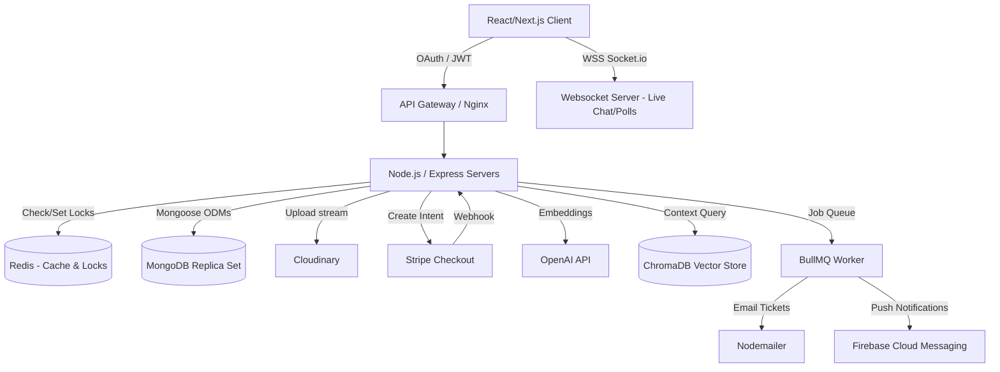

# EventX: High-Density System Architecture & Technical Spec
*(Mongoose / MongoDB Native Implementation)*

This document provides a deep, technically dense specification for building the Luma clone. It swaps Prisma for native MongoDB (via Mongoose) to leverage NoSQL flexibility, advanced indexing, and aggregation pipelines.

---

## 1. System Topology & Data Flow



---

## 2. Advanced Mongoose Schemas & Indexing Strategies

Instead of a relational model, we use references and strategic embedding.

### A. User Schema (`users` collection)
```javascript
const userSchema = new mongoose.Schema({
  email: { type: String, required: true, unique: true, index: true },
  passwordHash: { type: String, select: false }, // Hidden by default
  authProvider: { type: String, enum: ['local', 'google', 'apple'], default: 'local' },
  profile: {
    name: { type: String, required: true },
    avatarUrl: String,
    bio: String
  },
  roles: { type: [String], enum: ['user', 'organizer', 'admin'], default: ['user'] },
  twoFactorEnabled: { type: Boolean, default: false },
  twoFactorSecret: { type: String, select: false },
  refreshToken: { type: String, select: false } // For session rotation
}, { timestamps: true });
```

### B. Event Schema (`events` collection)
```javascript
const eventSchema = new mongoose.Schema({
  title: { type: String, required: true },
  slug: { type: String, required: true, unique: true },
  description: { type: String },
  bannerUrl: { type: String },
  
  organizerId: { type: mongoose.Schema.Types.ObjectId, ref: 'User', required: true, index: true },
  
  schedule: {
    startDate: { type: Date, required: true },
    endDate: { type: Date, required: true },
    timezone: { type: String, default: 'UTC' }
  },
  
  location: {
    type: { type: String, enum: ['online', 'physical'], required: true },
    address: String,
    // GeoJSON for spatial queries (finding events near user)
    coordinates: { 
      type: { type: String, enum: ['Point'] },
      coordinates: [Number] // [longitude, latitude]
    },
    meetingLink: String
  },
  
  ticketing: {
    capacity: { type: Number, required: true },
    ticketsSold: { type: Number, default: 0 },
    price: { type: Number, default: 0 }, // 0 = free
    currency: { type: String, default: 'USD' }
  },
  status: { type: String, enum: ['draft', 'published', 'cancelled'], default: 'draft' }
}, { timestamps: true });

// --- HIGH DENSITY INDEXING ---
// 1. Compound Index for discovery feed (Sort by date, filter by status)
eventSchema.index({ status: 1, 'schedule.startDate': 1 });

// 2. Geospatial Index for "Events near me"
eventSchema.index({ 'location.coordinates': '2dsphere' });

// 3. Text Index for search bar
eventSchema.index({ title: 'text', description: 'text' });
```

### C. Ticket Transaction Schema (`tickets` collection)
```javascript
const ticketSchema = new mongoose.Schema({
  eventId: { type: mongoose.Schema.Types.ObjectId, ref: 'Event', required: true },
  userId: { type: mongoose.Schema.Types.ObjectId, ref: 'User', required: true },
  
  qrCodeData: { type: String, required: true, unique: true },
  status: { type: String, enum: ['reserved', 'valid', 'scanned', 'refunded'], default: 'reserved' },
  
  payment: {
    stripeSessionId: { type: String, index: true }, // For webhook lookups
    amountPaid: Number,
    paidAt: Date
  }
}, { timestamps: true });

// Compound index to prevent a user buying multiple tickets if rules prohibit it
ticketSchema.index({ eventId: 1, userId: 1 }, { unique: true });
```

---

## 3. Core Engineering Workflows

### A. The Concurrency Problem: Redis Distributed Lock (Ticketing)
To prevent overselling when 500 users click "Buy" on an event with 10 remaining tickets:
1. **Pre-check (Redis):** Client hits `/api/checkout`. Backend checks `GET event:123:available_tickets` in Redis.
2. **Lock (Redis):** Backend executes atomic `DECR event:123:available_tickets`. 
    * If result < 0, return `400 Sold Out`. (Optionally `INCR` back).
3. **Hold:** Backend generates a temporary Stripe Session and sets a Redis key `SET ticket_hold:session_id userId EX 600` (10-minute expiry).
4. **Fulfillment (Webhook):** Stripe webhook hits `/webhook`. 
    * If success: Backend creates `Ticket` in MongoDB, `INCR event:123:ticketsSold`, removes Redis hold.
    * If timeout/failure: Webhook triggers an `INCR event:123:available_tickets` to release the ticket back to the pool.

### B. High-Performance Caching Strategy
*   **Event Feed:** The homepage query (`find { status: 'published' } sort startDate`) is cached in Redis: `SET discovery_feed JSON_STRING EX 300` (5 minutes).
*   **Cache Invalidation:** When an organizer publishes a *new* event, the backend fires `DEL discovery_feed` so the next user triggers a fresh DB query.

### C. AI Concierge (RAG Pipeline)
1. **Ingestion:** When `Event` is created, a Mongoose `post('save')` hook triggers a BullMQ worker.
2. **Embedding:** Worker sends event title, description, and logistics to OpenAI `text-embedding-3-small`.
3. **Vector DB:** Saves embedding to ChromaDB with metadata `{ eventId: "123" }`.
4. **Query:** User asks *"Is there parking?"* in the chat. Server embeds the question, queries ChromaDB filtering by `eventId: "123"`, retrieves the top 3 similar chunks, and feeds them to GPT-4o as context to answer.

---

## 4. API Endpoints Blueprint

| Route | Method | Purpose | High-Density Note |
| :--- | :--- | :--- | :--- |
| `/api/auth/oauth/google` | `GET` | Init OAuth | Issues signed JWT stored in HTTP-Only, Secure cookies. |
| `/api/events` | `GET` | Discovery Feed | Implements cursor-based pagination for high performance. Checks Redis first. |
| `/api/events` | `POST` | Create Event | Validates `req.body` using Zod/Joi. Triggers ChromaDB embedding worker. |
| `/api/tickets/checkout`| `POST` | Reserve Ticket | Uses Redis `DECR` for atomic capacity checking. Returns Stripe URL. |
| `/api/webhooks/stripe` | `POST` | Process Payment | Validates Stripe signature. Idempotent design (checks if `stripeSessionId` exists in DB before processing). |
| `/api/chat/ask` | `POST` | AI Query | Executes RAG flow. Uses Server-Sent Events (SSE) to stream the AI response back to the client. |

---

## 5. Security Protocols Implemented
*   **Rate Limiting:** `express-rate-limit` backed by Redis. Strict limit on `/api/auth/login` (5 per 15 min) and `/api/tickets/checkout` (2 per minute).
*   **Data Validation:** All incoming data strictly validated against schemas before hitting Mongoose to prevent NoSQL Injection.
*   **Helmet & CORS:** Strict Content Security Policy (CSP) and constrained CORS origins.

---

## 6. Infrastructure & Deployment (Infra)

To deploy this highly scalable architecture, the following infrastructure stack is recommended:

*   **Frontend Hosting (Client):** Vercel or AWS Amplify (for Next.js/React SSR optimization and edge caching).
*   **Backend Hosting (API & WebSockets):** AWS Elastic Beanstalk, Render, or DigitalOcean App Platform. Needs to support persistent WebSocket connections.
*   **Database (Primary):** MongoDB Atlas (Serverless or Dedicated Cluster).
*   **Database (Cache & Pub/Sub):** Upstash (Serverless Redis) or AWS ElastiCache.
*   **Vector Database:** Pinecone (managed SaaS) or ChromaDB hosted on a small DigitalOcean Droplet.
*   **Storage (Media):** Cloudinary (for on-the-fly image optimization and CDN distribution).
*   **CI/CD Pipeline:** GitHub Actions.
    *   *Workflow:* Push to `main` -> Run Jest tests -> Build Docker Image -> Push to AWS ECR / Render -> Deploy.

---

## 7. Development Tools & Libraries

| Category | Tools & Libraries |
| :--- | :--- |
| **Frontend Framework** | React (Next.js or Vite), TailwindCSS, Framer Motion (animations) |
| **Backend Framework** | Node.js, Express.js |
| **Database & ODM** | MongoDB, Mongoose |
| **Authentication** | Passport.js (OAuth), `jsonwebtoken` (JWT), `bcryptjs` |
| **Payment Processing** | Stripe Node.js SDK |
| **Real-time & Queues** | Socket.io (Websockets), BullMQ (Background Jobs) |
| **AI & Vector DB** | OpenAI SDK, ChromaDB client / Pinecone SDK |
| **Validation & Security** | Zod (Schema validation), Helmet, `express-rate-limit`, CORS |
| **Mailing & Media** | Nodemailer, Multer (multipart/form-data), Cloudinary SDK |
| **DevOps & Testing** | Docker, Jest, Supertest, GitHub Actions |

---

## 8. Strategic Implementation Phases

*   **Phase 1: Foundation (Week 1)**
    *   Setup Git repo, configure ESLint/Prettier.
    *   Initialize Express server and connect to MongoDB Atlas.
    *   Define Mongoose schemas (`User`, `Event`).
    *   Implement JWT Authentication and basic RBAC middleware.
*   **Phase 2: Core Business Logic (Week 2)**
    *   Implement full CRUD for Events.
    *   Integrate Cloudinary and Multer for uploading event banners.
    *   Build the frontend Discovery Feed utilizing MongoDB indexing for search and filtering.
*   **Phase 3: Financials & Concurrency (Week 3)**
    *   Integrate Stripe Checkout and configure Webhooks.
    *   Implement the Redis Distributed Lock for atomic ticket purchasing.
    *   Setup Nodemailer to dispatch QR code tickets upon successful webhook receipt.
*   **Phase 4: Real-time & AI (Week 4)**
    *   Setup Socket.io for live event chat.
    *   Configure BullMQ to run background jobs.
    *   Implement the RAG pipeline: vectorize event data into ChromaDB/Pinecone and create the AI Concierge chat endpoint.
*   **Phase 5: Production Readiness (Week 5)**
    *   Implement strict rate limiting and security headers (Helmet).
    *   Write core integration tests using Jest.
    *   Dockerize the backend.
    *   Deploy using GitHub Actions CI/CD.
